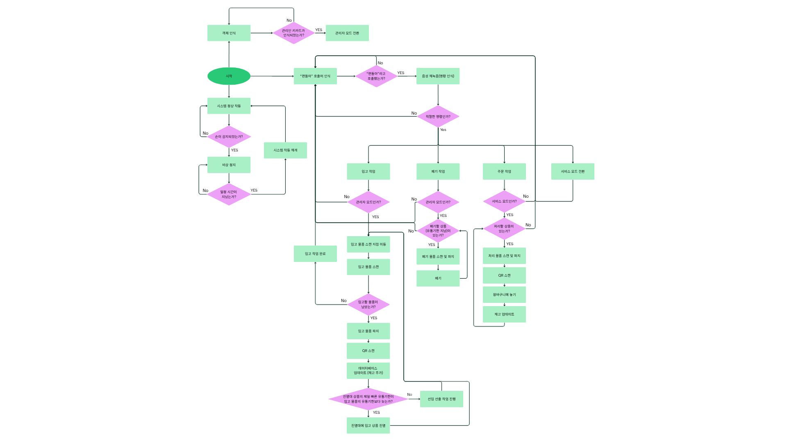

# [프로젝트 이름] 로봇팔을 이용한 편의점 무인화 시스템
> **조 이름:** [B-1 - ROKEY_B-1]
> **팀원:** [이준우, 김범준, 허재혁, 정준혁]

## 1. 📌 프로젝트 개요 (Project Introduction)
- 이 프로젝트는 ROS2 Humble 환경을 기반으로 제어되는 6축 다관절 로봇팔과 MySQL, realsense카메라 등을 이용해 자동으로 주문/입고/폐기 기능을 수행하는 편의점 무인화 시스템입니다. 
- YOLOv8 기반의 객체 인식을 통해 매대의 물품을 인식하고 각 물품의 QR코드를 인식하여 DB와 서로 통신하며 작업 수행 및 데이터를 관리합니다.
- Whisper-1과 GPT-4o 모델을 사용하여 사용자의 음성 명령을 인식하고 명령에 따른 작업을 수행합니다.

## 2. 🎨 시스템 설계 및 플로우 차트
### 2-1. 시스템 설계도 (System Architecture)
- 전체 구조는 크게 **음성인식 파트**, **데이터 처리 및 명령 파트**, **데이터베이스 파트**, **로봇제어 파트**, **비전인식** 파트 총 5가지 파트로 구분할 수 있습니다.
    - **음성인식 파트** 
      - 기술 스택: VAD(Voice Activity Detection), OpenAI Whisper-1, GPT-4o API
      - 상세 역할: Whisper-1 모델로 사용자의 음성을 텍스트로 변환합니다. 변환된 텍스트는 설정된 프롬프트에 따라서 GPT-4o 모델에 입력되고 출력된 값이 로봇에 명령(입고, 폐기, 주문)을 하는 트리거가 됩니다.
    - **데이터 처리 및 명령 파트**
      - 기술 스택: rclpy (Node, Action Client, Service Client) 
      - 상세 역할: 음성인식 파트로부터 온 명령에 따라서 Action 통신을 통해 로봇에게 동작 명령을 내립니다. 동작하면서 받아오는 여러 데이터들을 처리하고 정제하여 데이터베이스에 데이터 갱신을 요청하는 파트입니다.
    - **로봇제어 파트** 
      - 기술 스택: Doosan Robot ROS2 Driver (dsr_msgs2, DSR_ROBOT2), OnRobot RG Gripper
      - 상세 역할: Action 요청이 오면 실제로 로봇을 움직여서 작업을 수행하는 파트입니다. 작업 도중 손이 감지되면 즉시 정지하며 손이 사라지면 일정 시간 후 작업을 다시 재개합니다.
    - **데이터베이스 파트**
      - 기술 스택: MySQL, PyMySQL, SQL DictCursor 
      - 상세 역할: MySQL을 통해 물품의 정보들과 출고일, 재고수의 데이터를 관리하는 데이터베이스입니다. 유통기한과 재고수의 정보를 제공하여 어떤 작업을 해야하는지 결정해주는 파트입니다.
    - **비전인식 파트**
      - 기술 스택: OpenCV, Intel RealSense 3D Depth, YOLOv8, python3-ultralytics
      - 상세 역할: YOLOv8과 realsense 카메라, C270 웹캠을 사용하여 물품의 위치를 감지하고 QR을 인식하여 데이터를 제공해주는 파트입니다.  


### 2-2. 플로우 차트 (Flow Chart)
<p align="center">
  
</p>
---

## 3. 🖥️ 운영체제 환경 (OS Environment)
이 프로젝트는 다음 환경에서 개발하였습니다.

### 🔹 Software & Framework
* **OS:** Ubuntu 22.04 LTS
* **ROS Version:** ROS2 Humble
* **Language:** Python 3.10
* **Database:** MySQL 8.0 
* **IDE:** VS Code

---

## 4. 🛠️ 사용 장비 목록 (Hardware List)
프로젝트에 사용된 주요 하드웨어 장비입니다.

| 장비명 (Model) | 수량 | 비고 |
|:---:|:---:|:---|
| [Doosan Robot M0609 (6축 다관절 로봇)] | 1 | [ ] |
| [OnRobot RG2 Gripper] | 1 | [ ] |
| [Intel RealSense D435i 3D Depth Camera] | 1 | [ ] |
| [Logitech C270 HD Webcam] | 1 | [ ] |

---

## 4. 📦 의존성 (Dependencies)
프로젝트 실행에 필요한 라이브러리입니다.

* Python >= 3.8
* rclpy
* store_interfaces
  
### 1. 인프라 및 컨테이너 플랫폼 설치
- 도커 가상화 엔진 및 멀티 컨테이너 관리 툴 구성
```
sudo apt update
sudo apt install docker.io docker-compose-v2 -y
```

### 2. Python 외부 라이브러리 설치
- OpenAI API & LLM 프롬프트 제어 패키지
```
pip install openai langchain langchain-openai python-dotenv
```
- 마이크 입력 및 실시간 오디오 스트리밍 패키지
```
pip install pyaudio SpeechRecognition sounddevice
```
- YOLOv8 물품 인식 및 기하학 좌표 연산 패키지
```
pip install ultralytics opencv-python numpy scipy
```
- MySQL 데이터베이스 연동 패키지
```
pip install pymysql
```
- 온로봇 그리퍼 하드웨어 통신 패키지
```
pip install pymodbus
```
- FastAPI와 앱스미스를 연동해주는 패키지
```
pip install fastapi pydantic uvicorn
```

### 3. ROS2 패키지 설치
- OpenCV와 ROS 이미지 토픽 간 변환 브릿지 패키지
```
sudo apt install ros-humble-cv-bridge
```
- MySQL 데이터베이스 서버 및 개발 라이브러리 구축
```
sudo apt install mysql-server libmysqlclient-dev
```
- 우분투 시스템 오디오 커널 드라이버 및 C++ 개발용 헤더 패키지
```
sudo apt install portaudio19-dev libportaudio2 python3-pyaudio
```

---

## 5. ▶️ 실행 순서 (Usage Guide)
프로젝트를 실행하기 위한 순서입니다. 터미널 명령어를 순서대로 입력해 주세요.

### Step 1. 로봇팔 및 realsense depth 카메라, C270 웹캠 연결
  - 로봇팔, realsense depth 카메라, C270 웹캠 선을 연결하고 구동합니다.
```
realsense
```
```
roboton
```
※ realsense가 alias로 .bashrc에 등록되지 않았다면 다음을 입력합니다.
```
ros2 launch realsense2_camera rs_align_depth_launch.py depth_module.depth_profile:=848x480x30 rgb_camera.color_profile:=1280x720x30 initial_reset:=true align_depth.enable:=true enable_rgbd:=true pointcloud.enable:=true'
```
※ roboton이 alias로 .bashrc에 등록되지 않았다면 다음을 입력합니다.
```
ros2 launch dsr_bringup2 dsr_bringup2_rviz.launch.py mode:=real host:=192.168.1.100 port:=12345 model:=m0609
```

### Step 2. 워크스페이스에서 빌드 및 소스 작업을 수행합니다.
```
cd <본인 워크스페이스>
colcon build --symlink-install
source install/setup.bash
```

### Step 3. voice_processing 패키지의 STT.py와 store_node 패키지의 counter_qr_node.py를 열어서 각 마이크, QR 인식용 웹캠 index를 확인하고 변경합니다.

### Step 4. 데이터베이스(MySQL)를 만들고 데이터를 주입합니다.
```
mysql -u root -p -e "CREATE DATABASE IF NOT EXISTS <데이터베이스명>;"

mysql -u root -p <데이터베이스명> < convenience_store_db.sql
```

### Step 5. 데이터베이스 및 앱스미스(Appsmith) 인프라 구동
```
cd <본인 워크스페이스>/appsmith
docker compose up -d
```
- 웹 브라우저를 열고 http://localhost:8080에 접속합니다.
- 만약 화면이 비어있다면, 대시보드 우측 상단 create_new에서 Import -> From file을 선택하고 제공된 .json 백업 파일을 업로드합니다.
- 좌측 하단 Data Sources(원통 모형) 메뉴에서 본인 환경의 MySQL 계정 정보(Host, ID, PW)를 입력한 뒤 Test configuration 후 Save 하여 데이터베이스 연결을 동기화합니다.
- ※ host address에는 hostname -I를 입력했을 때 나오는 첫번째 IP를 사용합니다.
- ※ convenience_store_db를 Database name에 입력합니다.
```
hostname -I
```
- 에디터 우측 상단의 [Deploy] 버튼을 누른 후 [Launch]를 눌러 실전 키오스크 모드로 진입합니다.

### Step 6. 런치 파일을 실행합니다.
```
ros2 launch store_node store_node.launch.py
```

### Step 7-1. '편돌아'라고 음성 호출을 하고 실행할 작업(주문, 입고, 폐기)을 명령합니다.
- ※ 입고/폐기는 관리자 카드키를 카메라에 인식한 후(관리자 모드 변경) 실행 가능합니다.
- ※ 관리자 모드에서 서비스 모드로 전환하기 위해서는 '편돌아'라고 호출한 후 '서비스 모드'라고 명령하면 됩니다.

### Step 7-2. 앱스미스에서 원하는 상품을 추가하고 submit 버튼을 눌러 주문을 실행합니다.
</p>
